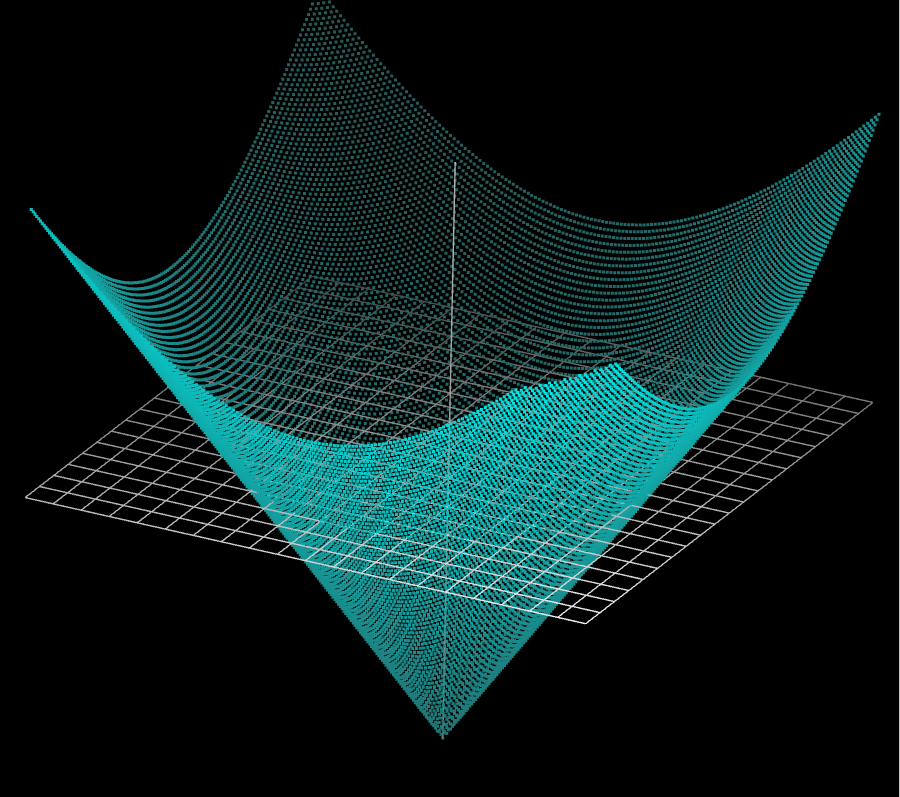
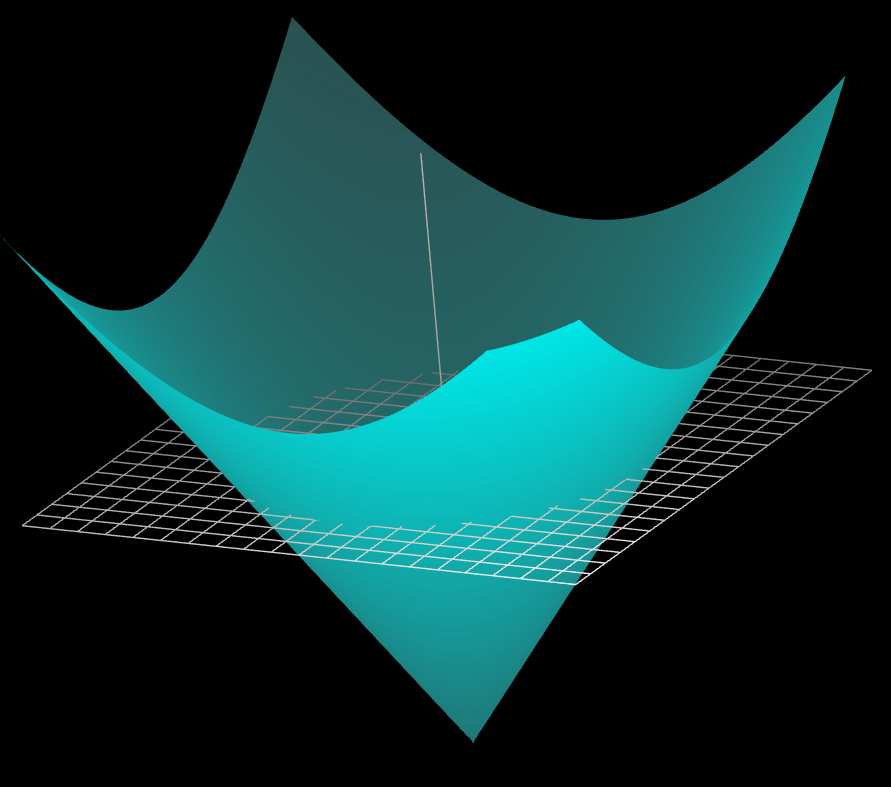
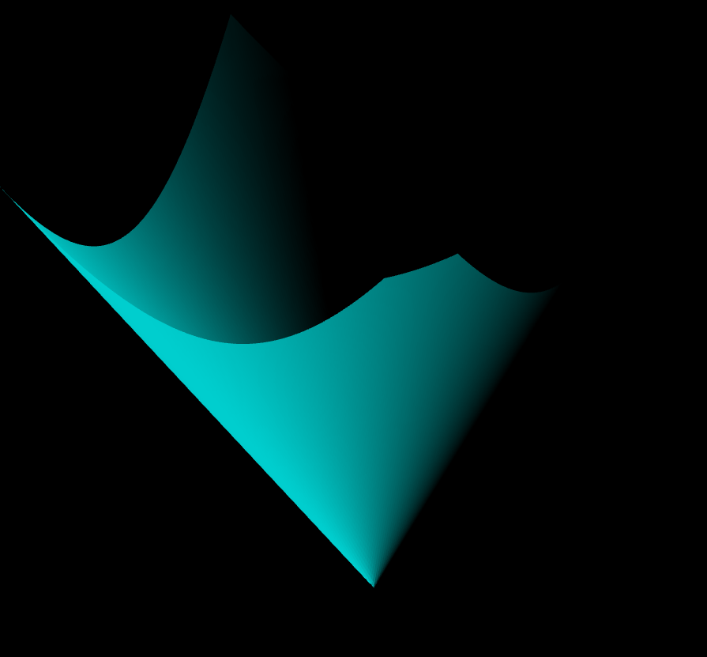

# WebGL-3D-plotter
Basic 3D function plotter in WebGL

Plotting predefined functions as point clouds and meshes with few different shaders: basic, blend, light.

Point cloud with blend shader

Mesh with basic shader:

Mesh with light shader:

